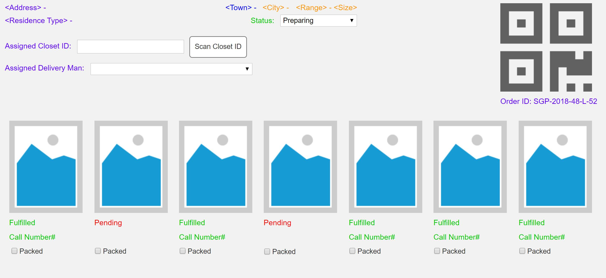

# Order details page using react

## Requirements

- This is a page that shows the details of a weekly order.
- Each order can have between 5 to 7 items, is tied to a City of delivery, primary key is Order ID.
- The QR code is just the QR code representation of the Order ID.
- Each item can be something new that we do not currently own, and thus need to purchase/ fulfil (status will be pending), or something from our existing collection (status will be fulfilled)
- For those items within our existing collection, there will be a call number that our warehouse staff to reference to.
- Clicking on items that are pending should open a new window to another page, Fulfil Order (for now just simulate a simple page to allow user to set the item to fulfil)
- When all items are fulfilled, the page will then allow the user to assign a Closet
- Only when a Closet is assigned, will the page allow the item to be set to “Packed”
- Only when all items are packed, can then the user be allowed to assign a delivery man
- Each Order is tied to a Member
- Each Member has a Delivery Address (Unit No, Blk No, Street, Town, Postal Code, as well as Residence Type – HDB, Condo, Apt, House, etc),
  - a Subscription Plan that states the Size (XS, S, M, L, XL)
  - and Range (Premium, High End, Luxurious) of
  - the Clothings the member has signed up for.

## UI Mockup

> 

## Dependacies Used

- Bootstrap: UI library for design
- url => URL formatting utility
- json-server => Fake REST apis for backend

## How to run

1. npm install -g json-server
2. npm install in project directory
3. Open another terminal => npm run jsonserver
4. Open another terminal => npm start

## Notes

1. json-server is running at port 3000
2. react app is running at port 3005
3. dummy database located in db.json
4. Database can be restored from initial db data located in db_v1.0.json

## Requirements Covered

1. Member details view
2. Creating and updating dummy data using api calls
3. OrderItems view
4. Fulfill order item functionality by clicking on order item image
5. Assign closet functionality
6. Validation for closet assign button, delivery man select dropdown

## Requirements not covered due to time limitations

1. Order status dropdown is not functional
2. Only when all items are packed, can then the user be allowed to assign a delivery man.

## Strategy

- Created main parent component (WeeklyOrderComponent)
- On mounting parent component I called api which fetches orderItems, Member details
- Then pass this data to child components.
- Child components updates data using PATCH http method and updates state of parent component (child --> parent data passing)
